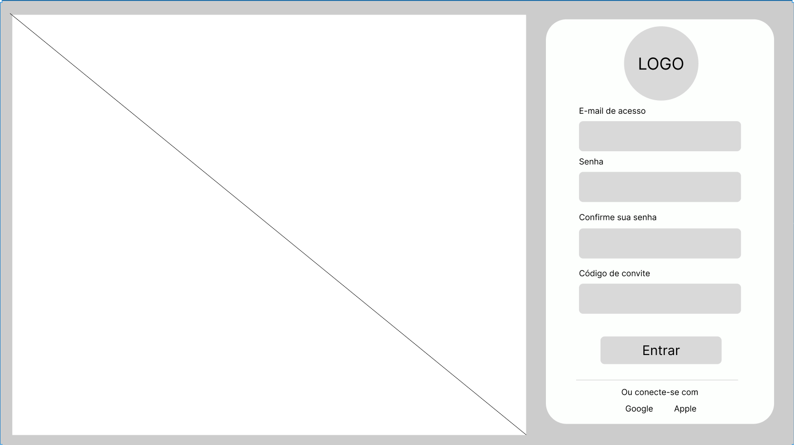
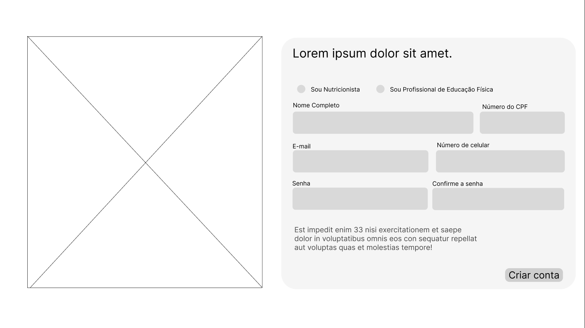
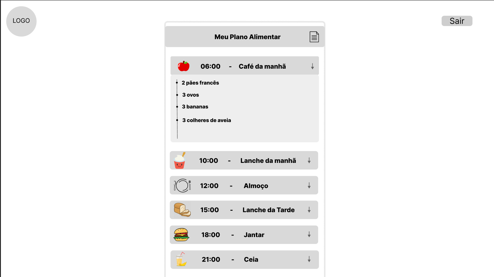
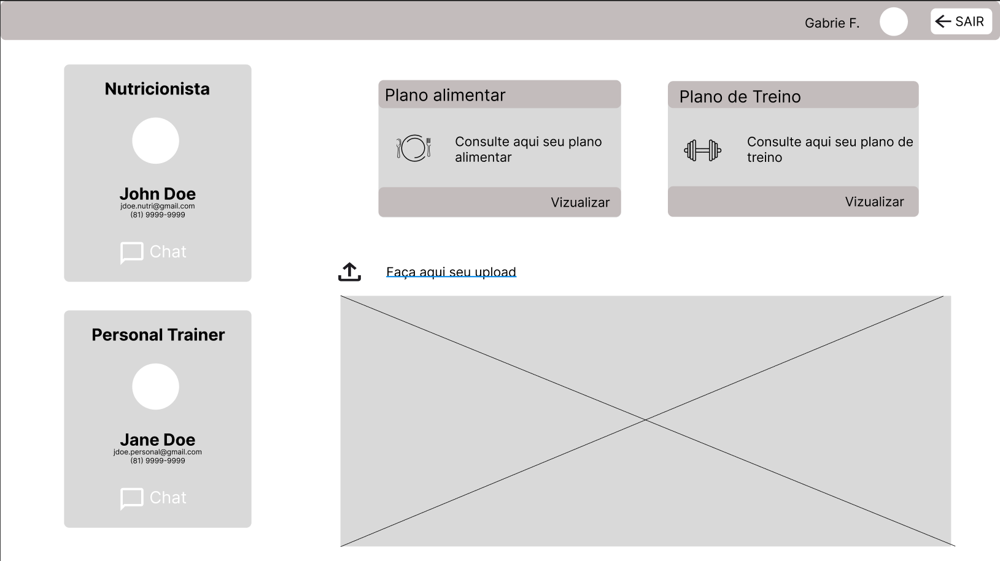
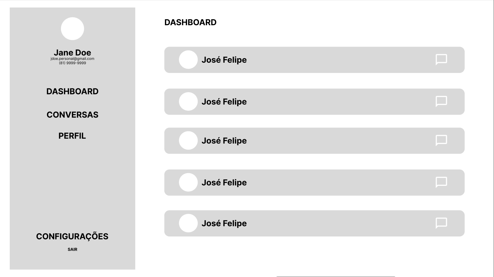
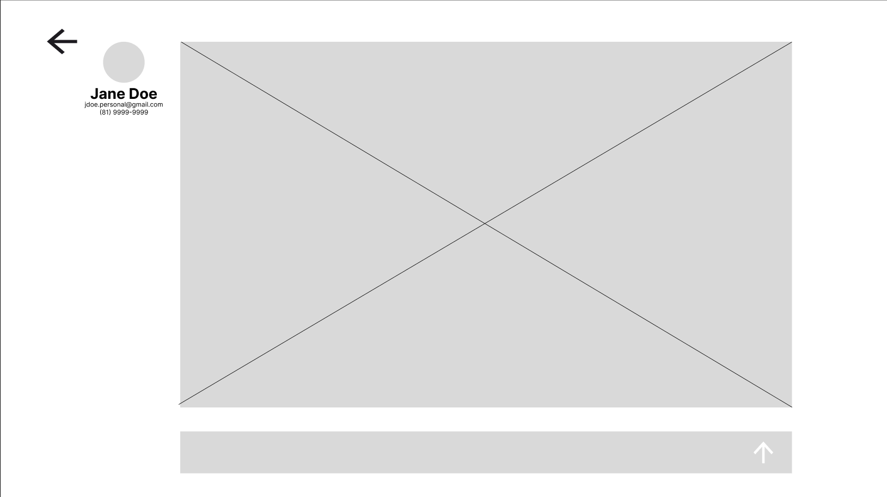

# VitalSync

## Equipe

Dayanne Moraes

Douglas Araújo

Ewerton Monteiro

Gabriel Farias

Isabela Karla

Luis Facunde

## Descrição

VitalSync é uma plataforma web que conecta profissionais de saúde, como nutricionistas e educadores físicos, aos seus alunos/pacientes. A plataforma permite que os alunos tenham acesso aos seus treinos semanais e dietas personalizadas, além de poderem interagir com os profissionais e compartilhar atualizações de progresso.

#### Backlog do Projeto

    

a
## Funcionalidades Principais

1. Perfis de usuário para profissionais e alunos/pacientes
2. Acesso dos alunos aos treinos semanais
3. Acesso dos alunos às dietas personalizadas
4. Sistema de mensagens para interação entre profissionais e alunos
5. Feed de atualizações para os alunos compartilharem seu progresso

## Histórias de Usuário

 
    

        Como aluno, quero me cadastrar na plataforma para ter acesso aos serviços dos profissionais de saúde.
    

        

 
    

        Como profissional, quero criar um perfil detalhado para atender aos clientes.
    

        

 
    

        Como paciente eu gostaria de visualizar o meu plano alimentar.
    

        

 
    

        Eu como paciente consigo fazer upload de atualizações sobre treinos e refeições.
    

        

 
    

         Eu como profissional consigo ver uma lista dos meus alunos no dashboard
    

        

 
    

        Eu como aluno consigo me comunicar via chat com profissionais. E como profissional consigo me comunicar via chat com os alunos.
    

        

 
    

        Eu como usuário consigo recuperar minhas credenciais de login
    

        

 
    

        Eu como profissional consigo incluir os dados antropométricos do paciente ou aluno.
    

        

 
    

        Como aluno eu quero visualizar o meu plano de treino.
    

        

 
    

        Eu como profissional consigo reagir aos posts dos alunos ou pacientes
    

        

[## Protótipo 🔗](https://drive.google.com/drive/folders/1lxHRWnrA0qhMDt9Ik8lSUNE0bxNaLfon?usp=drive_link)

## Instalação e Configuração

[Instruções de instalação e configuração do projeto serão adicionadas aqui]

## Contribuição

[Diretrizes para contribuição no projeto serão adicionadas aqui]

## Licença

[Informações sobre a licença do projeto serão adicionadas aqui]
